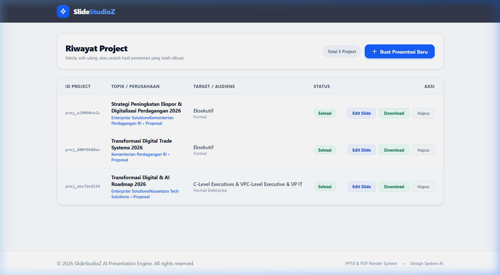
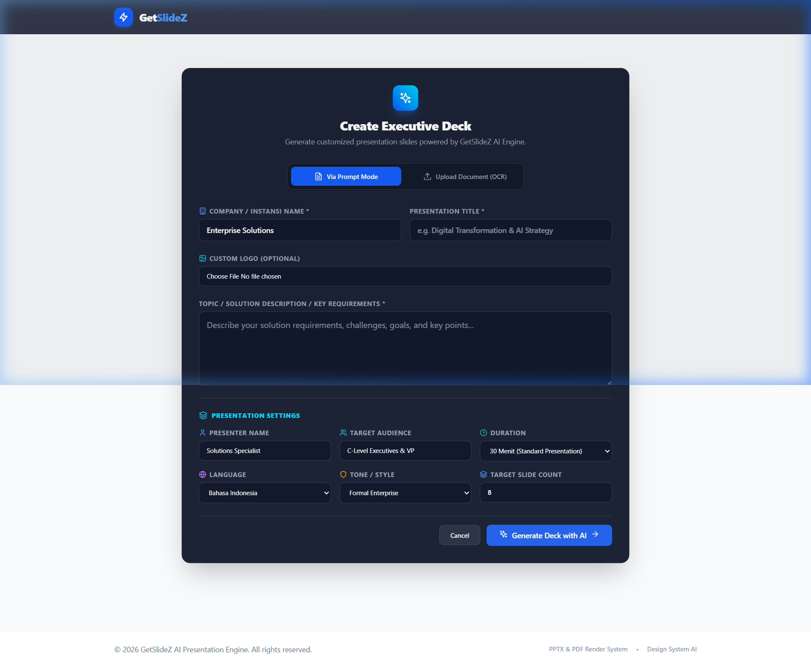
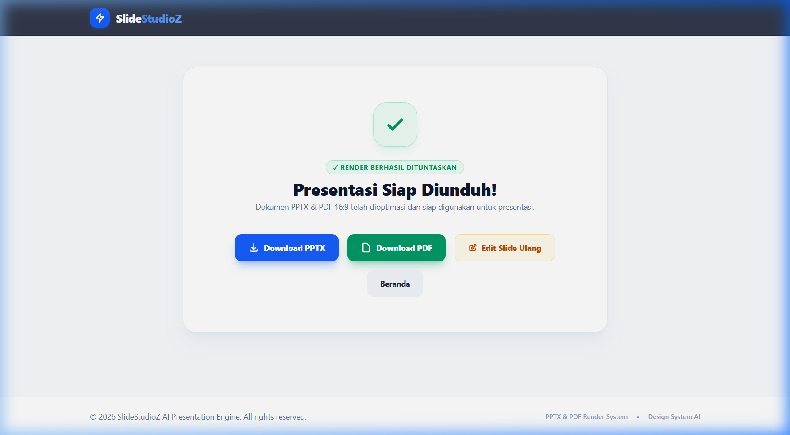

# SlideStudioZ

Executive AI Presentation Deck and Document Generator.

**Live Demo / Hosted Web Application**: [https://slidestudioz.salstudioz.top/](https://slidestudioz.salstudioz.top/)

SlideStudioZ is a full-stack presentation generator designed to build 16:9 widescreen PowerPoint (`.pptx`) and PDF (`.pdf`) slide decks from prompts, proposal briefs, document files (PDF/Images), and company knowledgebase files (`.txt`/`.md`).

---

## Application Screenshots

### Dashboard & Presentation History


### Creation Wizard & Metadata Configuration


### Export Result & Download


---

## Overview

SlideStudioZ provides an automated workflow to produce executive-grade presentation decks. It integrates document OCR extraction, OpenRouter LLM reasoning, DuckDuckGo web search grounding, AI image synthesis, and automated PowerPoint/PDF compilation.

The application can be operated through two interfaces:
1. **React Web Studio**: Web UI with slide previews, project history management, drag-and-drop document OCR uploader, custom logo uploader, and company knowledgebase manager.
2. **Terminal CLI**: Terminal interface built with Python `rich` for quick keyboard-driven generation and editing.

---

## Core Capabilities

- **Dual Input Modes**:
  - **Prompt Mode**: Generates slide decks from a topic description, target audience, duration, presenter, tone, and company profile.
  - **Document OCR Mode**: Extracts text from PDF reports, Word documents, text files, or image screenshots using Tesseract OCR and PyMuPDF, parsing every section into structured slides.
- **Company Knowledgebase Grounding (.txt / .md)**:
  - Supports uploading baseline context files (`.txt`/`.md`) containing company background, product specifications, mission statements, or factual data points to ground the LLM generation.
- **Dynamic Corporate Branding**:
  - Automatically formats header text (`{COMPANY_NAME} • PRESENTATION`), footer text (`{COMPANY_NAME} | {Slide Title}`), and embeds custom uploaded company logos (PNG, JPG, WEBP) on every generated slide.
- **LLM Engine & Search Grounding**:
  - Powered by OpenRouter API with automated model fallbacks (Google Gemma 4, DeepSeek, Claude, Llama).
  - Integrates real-time factual web search via DuckDuckGo Search (`DDGS`) to verify data points.
- **AI Image Synthesis**:
  - Generates 3D corporate visual illustrations per slide using Pollinations.ai API, formatted with anti-aliased rounded corners using Pillow.
- **7 Enterprise Slide Layouts**:
  - `cover`: Hero title, subtitle, presenter, audience, and top-right logo.
  - `divider`: Section overview and topic transition.
  - `content`: Bullet points with dynamic scaling and margin padding.
  - `two_column`: Feature comparison grid.
  - `stats`: Key KPI and big number callouts.
  - `cards`: Solution module cards.
  - `closing`: Call-to-action banner and contact details.
- **Automated PPTX and PDF Exporting**:
  - Generates 16:9 Widescreen `.pptx` (Microsoft PowerPoint) files with exact margin padding.
  - Converts `.pptx` to `.pdf` via Windows PowerPoint COM Automation (`win32com`) or ReportLab PDF renderer.

---

## System Architecture

```
+-----------------------------------------------------------------------+
|                           CLIENT INTERFACE                            |
|    +-----------------------------+   +---------------------------+    |
|    |  React 18 + Vite Web Studio |   | Rich Terminal CLI (Python)|    |
|    +--------------+--------------+   +-------------+-------------+    |
+-------------------|--------------------------------|------------------+
                    | REST API                       | Direct Call
                    v                                v
+-----------------------------------------------------------------------+
|                        FASTAPI BACKEND SERVICE                        |
|                                                                       |
|  +--------------------+  +--------------------+  +-----------------+  |
|  | Document OCR Engine|  | LLM Prompt Engine  |  | Image Service   |  |
|  | (Tesseract/PyMuPDF)|  | (OpenRouter/DDGS)  |  | (Pollinations)  |  |
|  +---------+----------+  +---------+----------+  +--------+--------+  |
|            |                       |                      |           |
|            +-----------------------+----------------------+           |
|                                    |                                  |
|                                    v                                  |
|                 +-----------------------------------+                 |
|                 | Widescreen PPTX & PDF Renderer    |                 |
|                 | (python-pptx / win32com)          |                 |
|                 +------------------+----------------+                 |
+------------------------------------|----------------------------------+
                                     v
+-----------------------------------------------------------------------+
|                             STORAGE LAYER                             |
|  +----------------------+  +------------------+  +-----------------+  |
|  | SQLite (projects/db) |  | Output PPTX/PDF  |  | Uploads & Logos |  |
|  +----------------------+  +------------------+  +-----------------+  |
+-----------------------------------------------------------------------+
```

---

## Directory Structure

```
final/
├── main.py                     # Entry point for Terminal CLI UI
├── server.py                   # FastAPI REST Backend server
├── run_app.py                  # Dual launcher for FastAPI + React Web UI
├── requirements.txt            # Python dependencies
├── .env.example                # Template environment variables
├── .gitignore                  # Git ignore rules
├── README.md                   # Technical documentation
├── assets/                     # Branding assets and screenshots
│   ├── slidestudioz_logo.png   # Default SlideStudioZ logo
│   ├── screenshots/            # Application interface screenshots
│   └── generated_images/       # Generated slide visual assets
├── outputs/                    # Output directory for PPTX and PDF files
├── temp_uploads/               # Temporary file uploads directory
├── src/                        # Python backend core modules
│   ├── config.py               # Application configuration and paths
│   ├── database.py             # SQLite database layer and migrations
│   ├── llm_service.py          # LLM prompt engine and document section parser
│   ├── generator_service.py    # PowerPoint (.pptx) and PDF renderer
│   ├── ocr_service.py          # Tesseract OCR and PyMuPDF text extractor
│   ├── image_service.py        # Pollinations.ai image generator
│   ├── web_search_service.py   # DuckDuckGo search integration
│   ├── cli_ui.py               # Rich CLI interface
│   └── knowledgebase.md        # Presentation guidelines and knowledgebase
└── frontend/                   # React 18 + Vite SPA application
    ├── package.json            # Node.js dependencies
    ├── vite.config.js          # Vite and Tailwind CSS configuration
    ├── index.html              # HTML entry page
    └── src/                    # React components and pages
```

---

## Prerequisites

Ensure the following dependencies are installed on your environment:

1. **Python 3.10+**
2. **Node.js 18+ and npm**
3. **Tesseract OCR Binary** *(Optional, required for image OCR extraction)*:
   - Windows default location: `C:\Program Files\Tesseract-OCR\tesseract.exe` or `D:\Tesseract-OCR\tesseract.exe`.
4. **OpenRouter API Key**:
   - Obtain an API key from [OpenRouter.ai](https://openrouter.ai/).

---

## Installation and Configuration

1. **Clone the repository**:
   ```bash
   git clone https://github.com/salstudioz/slidestudioz.git
   cd slidestudioz
   ```

2. **Configure Environment Variables**:
   Copy `.env.example` to `.env`:
   ```bash
   cp .env.example .env
   ```
   Set your OpenRouter API key and Tesseract path in `.env`:
   ```env
   OPENROUTER_API_KEY=your_openrouter_api_key_here
   OPENROUTER_MODEL=openrouter/free
   TESSERACT_CMD=D:\Tesseract-OCR\tesseract.exe
   ```

3. **Install Python Backend Dependencies**:
   ```bash
   pip install -r requirements.txt
   ```

4. **Install React Frontend Dependencies**:
   ```bash
   cd frontend
   npm install
   cd ..
   ```

---

## Running the Application

### Option A: Web Application (React + FastAPI)

- Hosted Production Web Application: [https://slidestudioz.salstudioz.top/](https://slidestudioz.salstudioz.top/)

To run locally, start both the FastAPI backend server and React Vite dev server using the dual launcher:

```bash
python run_app.py
```

- Local Backend REST API: `http://127.0.0.1:8000`
- Local Web Studio Frontend: `http://localhost:5173`

### Option B: Interactive Terminal CLI

Run the command-line interface directly:

```bash
python main.py
```

---

## REST API Reference

| Method | Endpoint | Description |
| :--- | :--- | :--- |
| `GET` | `/api/health` | Service health status check |
| `GET` | `/api/projects` | List all presentation projects |
| `POST` | `/api/projects` | Create a new presentation project |
| `GET` | `/api/projects/{id}` | Get project metadata and slide list |
| `DELETE` | `/api/projects/{id}` | Delete a project and associated slides |
| `POST` | `/api/projects/{id}/draft` | Generate or regenerate slide draft using LLM |
| `PUT` | `/api/projects/{id}/draft` | Update slide content, titles, or layout types |
| `POST` | `/api/projects/{id}/generate` | Compile deck to `.pptx` and `.pdf` files |
| `GET` | `/api/projects/{id}/download` | Download compiled `.pptx` or `.pdf` file |
| `POST` | `/api/upload` | Upload PDF or image file and extract text via OCR |
| `POST` | `/api/upload-logo` | Upload custom corporate logo (PNG/JPG/WEBP) |
| `POST` | `/api/upload-knowledgebase` | Upload baseline company knowledge file (.txt/.md) |

---

## Environment Variables Reference

| Variable | Description | Default Value |
| :--- | :--- | :--- |
| `OPENROUTER_API_KEY` | OpenRouter API authentication key | *Required* |
| `OPENROUTER_MODEL` | Primary LLM model identifier | `openrouter/free` |
| `TESSERACT_CMD` | Executable path for Tesseract OCR | `D:\Tesseract-OCR\tesseract.exe` |

---

## Troubleshooting

### 1. Tesseract OCR Not Found
If image OCR fails, verify that Tesseract is installed and the executable path in `.env` matches your system installation:
```env
TESSERACT_CMD=C:\Program Files\Tesseract-OCR\tesseract.exe
```

### 2. PDF Export Fallback
SlideStudioZ attempts to convert `.pptx` to `.pdf` using Microsoft PowerPoint COM automation (`win32com`). If Microsoft PowerPoint is not installed, the application automatically falls back to ReportLab to generate the PDF file.

### 3. OpenRouter Rate Limits
If the default model encounters rate limits, SlideStudioZ automatically fails over to backup free models (`google/gemma-4-26b-a4b-it:free`, `google/gemma-4-31b-it:free`) or uses its document-driven section parser engine.

---

## License

Distributed under the **MIT License**. See `LICENSE` for details.
